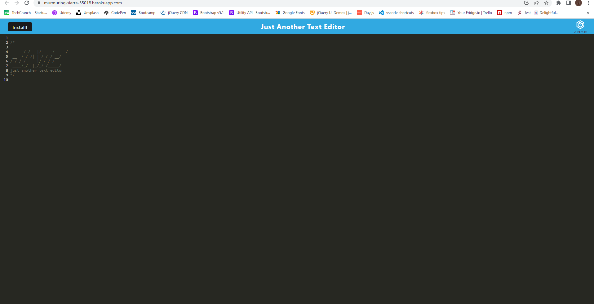

# text-editor

## Description

The motivation for this project was to create a text-editor that can be installed with a service worker generated by webpack. I built this to get practice with webpack and PWAs and to create a useful tool that can be installed on a device an run offline. It solves the problem of having a clean text editor that is lightweight and can be directly installed to a user's device. I learned a lot about how to configure service workers using webpack to build and deploy an application and PWA. 

## Table of Contents (Optional)

- [Installation](#installation)
- [Usage](#usage)
- [Credits](#credits)
- [License](#license)

## Installation

Run npm install to install all dependencies and npm run start:dev to run in a development environment. To install on your device just go to the url https://murmuring-sierra-35018.herokuapp.com/ and click the install button or the download icon in the url bar. 

## Usage

The application will work like any other text editor. You can type your code or text without any of the other junk that many documents add and it will automatically be saved to the IndexDB so you can leave and come back to your work later. To Install it on your device, click on the install button and you can use it without your browser.

## Credits

Starter code from EdX coding bootcamp

## License

No license